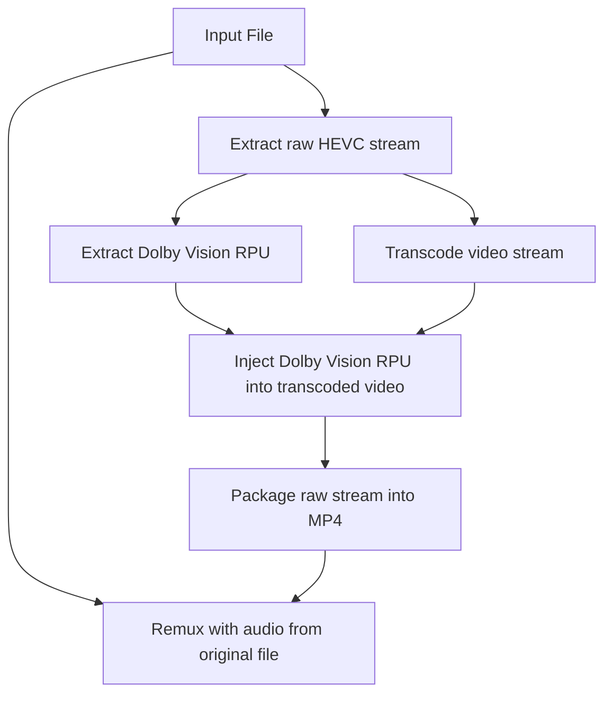

# Tdarr_Plugins_DoVi

Tdarr plugins expanded with the ability to transcode Dolby Vision videos and remux them into MP4s compatible with LG TVs.

## Why

LG WebOS doesn't support playing back Dolby Vision content from mkv containers, only from mp4. This could be simply solved by remuxing with `ffmpeg` using the `-strict unofficial` flag as of version 6.0. But I also wanted to downscale the videos to 1080p to save space as I don't care about 4k, but most Dolby Vision content is only available in 4k.

## How it works

One cannot simply transcode the video stream to achieve this like with SDR content (or with HDR10 for that matter).

For Dolby Vision profile 7 is not supported at the moment, for profile 4, 5 and 8 the process is the following:



Basically the Dolby Vision metadata has to be extracted first, then added back onto the transcoded video stream. This process can be done with profile 7 as well, it just involved some extra steps, but most content is not in profile 7.

This process is based on the excellent tool and writeup by [@gacopl](https://github.com/gacopl): [dvmkv2mp4](https://github.com/gacopl/dvmkv2mp4)

### Extracting the stream

The [Extract Streams](FlowPluginsTs/CommunityFlowPlugins/ffmpegCommand/ffmpegCommandExtractStreams/1.0.0/index.ts) plugin is responsible for this step. It will extract the HEVC stream and save it in the working directory with the same name as the original file but with `.hevc` extension. It will also extract all ASS and SRT subtitles and save them as `.srt` files in the `sub_streams` folder in the working directory for later use. The subtitle files will be annotated with their metadata (language, forced, sdh, default) that will be picked up by Jellyfin. The plugin also supports filtering subtitles based on language.

**Important:** to reorder streams before this plugin and have the video stream as the last stream. This is because all the subtitle streams have their own outputs defined in the middle of the ffmpeg command. Tdarr handles streams in order when building the ffmpeg command parameters and the video stream if not the last will not be matched to the proper output.

<details>
<summary>Example command</summary>

```sh
tdarr-ffmpeg -y \
    -i /path/to/input.mkv \
    -map 0:3 -c:s:0 copy /temp/tdarr-workDir-node-J2D7FNt5O-worker-open-ox-ts-1710332442638/sub_streams/2.hun.default.forced.srt \
    -map 0:4 -c:s:0 copy /temp/tdarr-workDir-node-J2D7FNt5O-worker-open-ox-ts-1710332442638/sub_streams/3.hun.srt \
    -map 0:5 -c:s:0 copy /temp/tdarr-workDir-node-J2D7FNt5O-worker-open-ox-ts-1710332442638/sub_streams/4.eng.srt \
    -map 0:6 -c:s:0 copy /temp/tdarr-workDir-node-J2D7FNt5O-worker-open-ox-ts-1710332442638/sub_streams/5.eng.sdh.srt \
    -map 0:0 -c:v copy -bsf:v hevc_mp4toannexb /temp/tdarr-workDir-node-J2D7FNt5O-worker-open-ox-ts-1710332442638/1710332450149/input.hevc
```
</details>

### Extracting Dolby Vision RPU

The [Extract DoVi RPU](FlowPluginsTs/CommunityFlowPlugins/video/extractDoViRpu/1.0.0/index.ts) plugin is responsible for extracting Dolby Vision RPU data. To achieve this [dovi_tool](https://github.com/quietvoid/dovi_tool) is needed. The plugin will extract the RPU data from the HEVC stream and save it to the working directory as a `.rpu.bin` file for later use.

<details>
<summary>Example command</summary>

```sh
/usr/local/bin/dovi_tool \
    -c \    # Crop, remove letterbox
    -m 2 \  # Mode 2, converts the RPU to be profile 8.1 compatible.
    extract-rpu /shows/Transcode/tdarr-workDir-node-J2D7FNt5O-worker-open-ox-ts-1710332442638/1710332450149/input.hevc
    -o /temp/tdarr-workDir-node-J2D7FNt5O-worker-open-ox-ts-1710332442638/dovi_tool/input.rpu.bin
```
</details>

### Transcoding video stream

I'm using Intel Kaby Lake CPUs (7th gen) to transcode video. There's one caveat I discovered here: while regular videos have no issues playing back if transcoded using quality based rate control methods supported by Intel Quicksync (CQP, ICQ) ([ffmpeg documentation](https://ffmpeg.org/ffmpeg-codecs.html#Ratecontrol-Method)) when used on Dolby Vision content it will result in a playback error. Thus for this purpose I have to fall back on good old VBR ratecontrol. I found that Netflix is using ~5Mbps for streaming 1080p Dolby Vision content, so I've set the same.

<details>
<summary>Example command</summary>

```sh
tdarr-ffmpeg -y \
    -hwaccel_output_format qsv -init_hw_device qsv:hw_any,child_device_type=vaapi -hwaccel qsv
    -i /temp/tdarr-workDir-node-J2D7FNt5O-worker-open-ox-ts-1710332442638/1710332450149/input.hevc \
    -map 0:0 -c:0 hevc_qsv \
    -qp 22 \    # This is ignored by the hevc_qsv encoder, but tdarr puts it in either way
    -preset slow \  # Slow preset provides a good enough quality while not taking 3 and a half decades
    -vf scale_qsv=1920:-1 \ # Set resolution and calculate height to handle 16:9 and letterbox videos as well
    -pix_fmt + \    # Keep the same pixel format as the input
    -look_ahead_depth 100 -rdo 1 -mbbrc 1 -b_strategy 1 -adaptive_i 1 -adaptive_b 1 \   # QSV specific parameters, some of these are probably ignored when using VBR
    -b:v 5M \   # Target an average of 5M bitrate
    /shows/Transcode/tdarr-workDir-node-J2D7FNt5O-worker-open-ox-ts-1710332442638/1710332520936/input.hevc
```
</details>

### Injecting RPU into the transcoded stream

The [Inject DoVi RPU](FlowPluginsTs/CommunityFlowPlugins/video/injectDoViRpu/1.0.0/index.ts) plugin is responsible for injecting the RPU data back into the video stream. The process is the reverse of [extracting Dolby Vision RPU](#extracting-dolby-vision-rpu) using [dovi_tool](https://github.com/quietvoid/dovi_tool) again. Inject the previously saved RPU data from the `.rpu.bin` file, injects it into the transcoded stream from the previous step and save the resulting video stream as an `.rpu.hevc` file in the workspace.

<details>
<summary>Example command</summary>

```sh
/usr/local/bin/dovi_tool \
    -i /shows/Transcode/tdarr-workDir-node-J2D7FNt5O-worker-open-ox-ts-1710332442638/1710332520936/input.hevc \ # Transcoded video from previous step
    --rpu-in /temp/tdarr-workDir-node-J2D7FNt5O-worker-open-ox-ts-1710332442638/dovi_tool/input.rpu.bin \
    extract-rpu /shows/Transcode/tdarr-workDir-node-J2D7FNt5O-worker-open-ox-ts-1710332442638/1710332450149/input.hevc \
    -o /temp/tdarr-workDir-node-J2D7FNt5O-worker-open-ox-ts-1710332442638/1710333079164/input.rpu.hevc
```
</details>

### Package HEVC stream in MP4

For better compatibility I use [MP4Box](https://wiki.gpac.io/MP4Box/MP4Box/) to package the stream into an mp4 container. Anecdotally MP4Box handles this better than ffmpeg, at least at the time of writing. This is handled by the [Package DoVi mp4](FlowPluginsTs/CommunityFlowPlugins/video/packageDoViMp4/1.0.0/index.ts) plugin. This resulting mp4 will only have the video stream in it, it will be used in the next step along with the audio streams from the input file to remux into the final form.

<details>
<summary>Example command</summary>

```sh
/usr/local/bin/MP4Box \
    -add /temp/tdarr-workDir-node-J2D7FNt5O-worker-open-ox-ts-1710332442638/1710333079164/input.rpu.hevc:dvp=8.1:xps_inband:hdr=none \
    -tmp /temp/tdarr-workDir-node-J2D7FNt5O-worker-open-ox-ts-1710332442638/1710333091979/tmp \
    -brand mp42isom \
    -ab dby1 \
    -no-iod \
    -enable 1 \
    /temp/tdarr-workDir-node-J2D7FNt5O-worker-open-ox-ts-1710332442638/1710333091934/input.rpu.hevc.mp4
```
</details>

### Remuxing into the final MP4

The [Remux DoVi MP4](FlowPluginsTs/CommunityFlowPlugins/ffmpegCommand/ffmpegCommandRemuxDoviMp4/1.0.0/index.ts) plugin is responsible for creating the right ffmpeg arguments to mux the correct streams together. The plugin will take the video stream from the mp4 file created in the previous step and mux it together with the audio streams from the original file. There are a couple of extra steps involved here: TrueHD audio streams are dropped as ffmpeg support for them in mp4 containers is experimental and I couldn't get it to work properly. Also metadata is copied from the original file.

Stream titles are handled differently in mp4 containers than in mkv, to deal with this the original audio stream titles are mapped to the `handler_name` metadata tag in the output file as Jellyfin [will use that](https://github.com/jellyfin/jellyfin/blob/v10.8.13/MediaBrowser.MediaEncoding/Probing/ProbeResultNormalizer.cs#L703-L711) to read stream titles as a fallback.

Chapter data is copied as part of the metadata, but chapter titles are dropped as it will result in a data stream in the output file which I found to cause playback issues.

<details>
<summary>Example command</summary>

```sh
tdarr-ffmpeg -y \
    -i /temp/tdarr-workDir-node-J2D7FNt5O-worker-open-ox-ts-1710332442638/1710333091934/input.rpu.hevc.mp4 \
    -i /path/to/input.mkv \ # Original file
    -map 0:0 -c:0 copy \    # Copy video from the previous mp4
    -map 1:a -c:a copy \    # Copy audio from original file
    -map_metadata 1 \       # Copy metadata from original file
    -map_metadata:c -1 \    # Drop chapter titles
    -dn \                   # Drop data streams
    -movflags +faststart \  # Add fast start flag, not strictly necessary
    -strict unofficial \    # Dolby Vision support is behind this flag
    /temp/tdarr-workDir-node-J2D7FNt5O-worker-open-ox-ts-1710332442638/1710333113706/input.mp4
```
</details>

## Other plugins

### Parse file with Radarr or Sonarr

The [Parse file with Radarr or Sonarr](FlowPluginsTs/CommunityFlowPlugins/tools/parseFileWithRadarrOrSonarr/1.0.0/index.ts) plugin is used to get additional info about the input file from Sonarr / Radarr. The library is handled by these two, so it's safe to assume they will have additional info about the files.

The plugin will save the info in a file named `arr.json` in the working directory.

```json
{
  "fileId": 1234,
  "originalPath": "/path/to/input.mkv",
  "releaseGroup": "AWESOMERLS",
  "sceneName": "My.Input.Movie.SceneName.2042.1080p.BluRay.x264-AWESOMERLS"
}
```

#### Configuration

Use library variable to provide configuration data for this plugin.

```
arr_api_key: y42k7kjg5f3htd6afktixqd8e5he2n84
arr_host: http://radarr.media.svc.cluster.local:7878
arr: radarr
```

These can be referenced in the plugin input like this: `{{{args.userVariables.library.arr_host}}}`

## References

* [dvmkv2mp4](https://github.com/gacopl/dvmkv2mp4) - Convert any Dolby Vision/HDR10+ MKV to MP4 that runs on many devices
* [dovi_tool](https://github.com/quietvoid/dovi_tool)
* [MP4Box](https://wiki.gpac.io/MP4Box/MP4Box/)

<details>
<summary>Original readme</summary>

# Tdarr_Plugins

Visit the docs for more info:
https://docs.tdarr.io/docs/plugins/basics


### Development

Make sure NodeJS v16 is installed

Install dependencies:

`npm install`

Run ESLint:

`npm run lint:fix`

Check plugins using some extra custom rules:

`npm run checkPlugins`

Run tests:

`npm run test`


# Steps to write a Tdarr Flow plugin:

1. Clone this repo
2. Set env variable `pluginsDir` to the location of the plugins repo and run Tdarr Server and Node. E.g. `export pluginsDir=C:/Tdarr_Plugins`
3. Browse the typescript plugins here https://github.com/HaveAGitGat/Tdarr_Plugins/tree/master/FlowPluginsTs/CommunityFlowPlugins and make edits locally or create a new one locally: 
4. Make sure typescript is intalled with `npm i -g typescript` then run `tsc` to compile the changes.
5. Refresh the browser and Tdarr will pick up the changes

</details>
