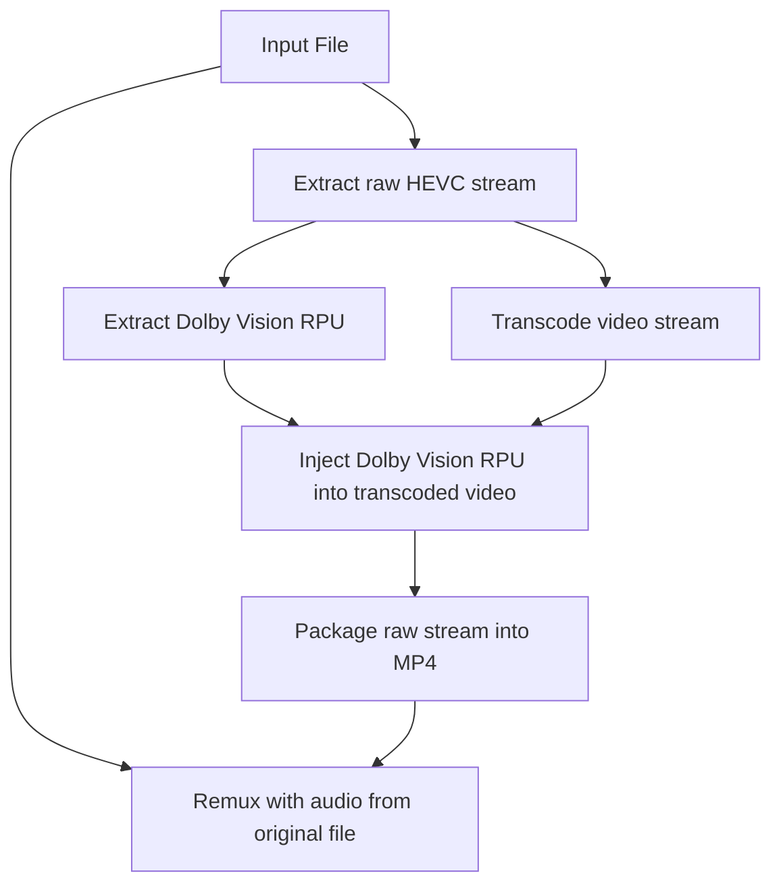

# Tdarr_Plugins_DoVi

Tdarr plugins expanded with the ability to transcode Dolby Vision videos and remux them into MP4s compatible with LG TVs.

## Why

LG WebOS doesn't support playing back Dolby Vision content from mkv containers, only from mp4. This could be simply solved by remuxing with `ffmpeg` using the `-strict unofficial` flag as of version 6.0. But I also wanted to downscale the videos to 1080p to save space as I don't care about 4k, but most Dolby Vision content is only available in 4k.

## How it works

One cannot simply transcode the video stream to achieve this like with SDR content (or with HDR10 for that matter).

For Dolby Vision profile 7 is not supported at the moment, for profile 4, 5 and 8 the process is the following:

Basically the Dolby Vision metadata has to be extracted first, then added back onto the transcoded video stream. This process can be done with profile 7 as well, it just involved some extra steps, but most content is not in profile 7.

Original readme

# Tdarr_Plugins

Visit the docs for more info:
https://docs.tdarr.io/docs/plugins/basics

### Development

Make sure NodeJS v16 is installed

Install dependencies:

`npm install`

Run ESLint:

`npm run lint:fix`

Check plugins using some extra custom rules:

`npm run checkPlugins`

Run tests:

`npm run test`

# Steps to write a Tdarr Flow plugin:

1. Clone this repo
2. Set env variable `pluginsDir` to the location of the plugins repo and run Tdarr Server and Node. E.g. `export pluginsDir=C:/Tdarr_Plugins`
3. Browse the typescript plugins here https://github.com/HaveAGitGat/Tdarr_Plugins/tree/master/FlowPluginsTs/CommunityFlowPlugins and make edits locally or create a new one locally: 
4. Make sure typescript is intalled with `npm i -g typescript` then run `tsc` to compile the changes.
5. Refresh the browser and Tdarr will pick up the changes

